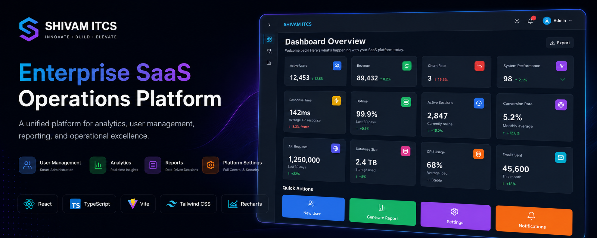
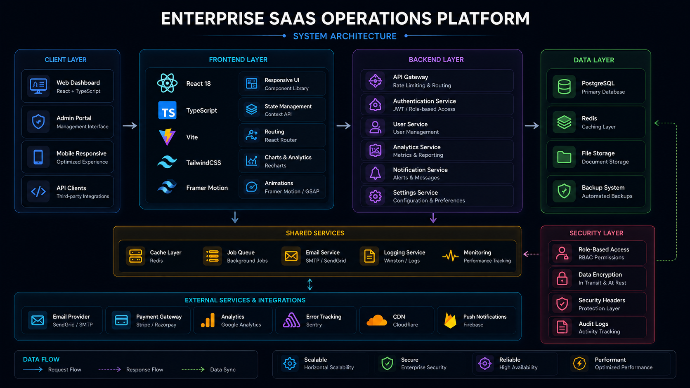
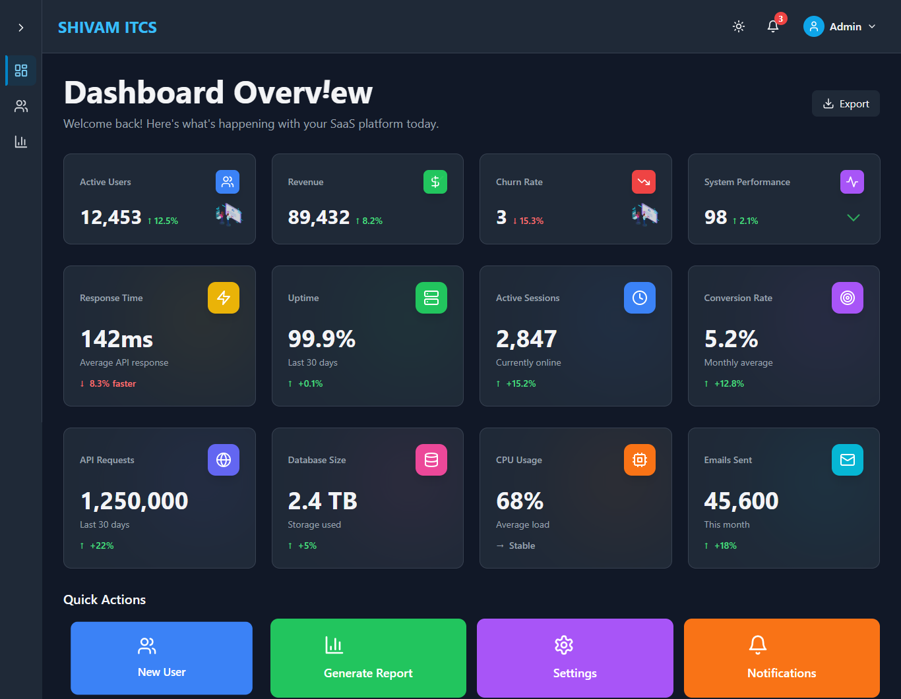
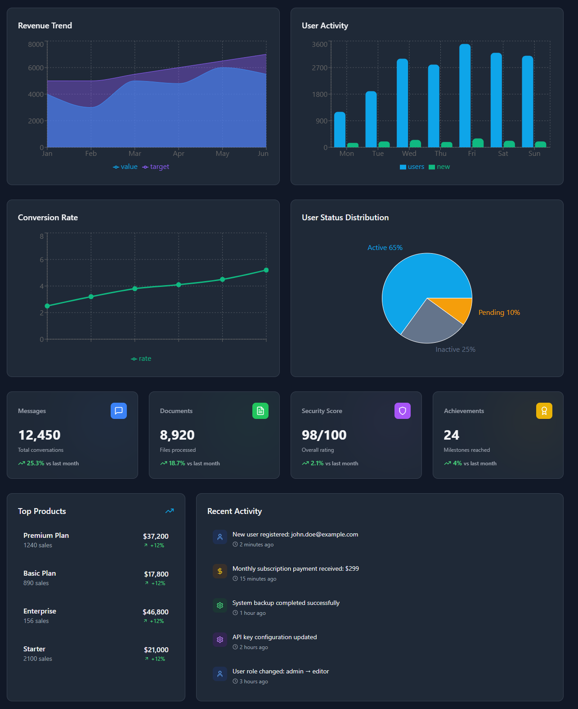
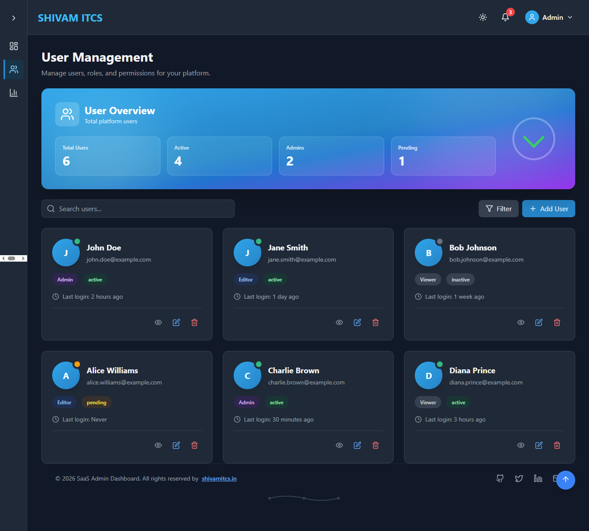
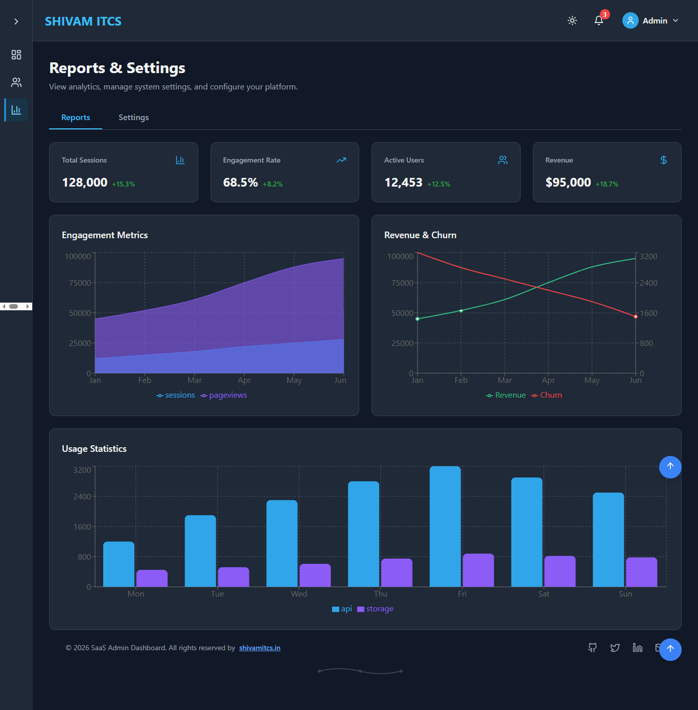
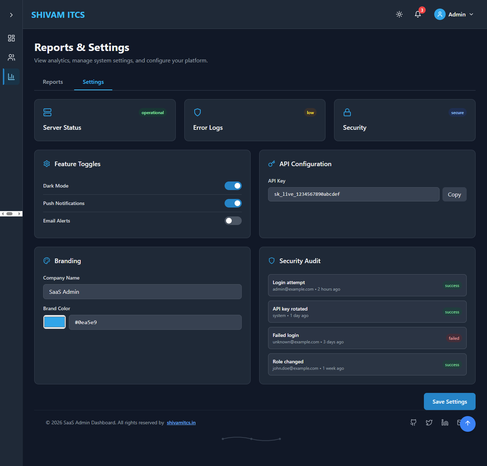

# SHIVAM ITCS — Enterprise SaaS Operations Platform


Enterprise-grade SaaS Operations Platform engineered for analytics monitoring, user administration, reporting workflows, platform configuration, and business intelligence experiences.

---

<p align="center">
  
</p>

---

## 🌐 Live Demo

🌐 https://saas.shivamitconsultancy.com/

---

# Platform Vision

Modern SaaS businesses require centralized operational visibility, user administration, analytics reporting, and platform management capabilities.

The Enterprise SaaS Operations Platform provides a unified workspace for monitoring business performance, managing users, analyzing operational metrics, configuring platform settings, and delivering modern administration experiences through a scalable dashboard architecture.

Designed with a product-engineering mindset, the platform focuses on operational efficiency, business intelligence, responsive user experiences, and enterprise-grade dashboard systems.

---

# Platform Highlights

- Enterprise SaaS dashboard architecture 
- Interactive analytics and reporting
- User management workflows
- Business intelligence visualizations
- Dark & Light mode support
- Responsive administration interface
- Security monitoring workflows
- Platform configuration system
- Modern UI/UX architecture
- Advanced data visualization

---

# 👥 User Administration System

The platform provides centralized user administration workflows for managing users, monitoring activity, and maintaining operational visibility.

## Supported Operations

- User Management
- User Status Tracking
- User Search & Filtering
- Activity Monitoring
- Account Administration
- User Analytics

---

# 📊 Analytics & Reporting Infrastructure

The platform includes modern analytics and reporting capabilities designed to help organizations monitor operational performance and business growth.

### Dashboard Analytics

- KPI Monitoring
- Revenue Tracking
- User Growth Analysis
- System Performance Metrics
- Activity Monitoring
- Operational Insights

### Business Intelligence

- Revenue Analytics
- Engagement Tracking
- Conversion Monitoring
- Usage Statistics
- Trend Analysis
- Reporting Dashboards

---

# ⚙️ Platform Management Infrastructure

The platform includes administration and configuration capabilities designed for operational management.

### Settings & Configuration

- Platform Preferences
- Feature Toggles
- Branding Controls
- Configuration Management

### Security Monitoring

- Operational Visibility
- Security Auditing
- Activity Monitoring
- Administrative Controls

---

# Enterprise Features

- Business KPI Monitoring
- User Lifecycle Management
- Operational Reporting
- Security Monitoring
- Platform Configuration
- Interactive Analytics
- Responsive Dashboard System
- Dark & Light Theme Support
- Modern Design System
- Component-Driven Architecture

---

# Technology Stack

## Frontend Engineering

- React
- TypeScript
- Vite
- TailwindCSS
- React Router

---

## UI & Design System

- TailwindCSS
- Lucide React
- Responsive Layout System
- Component-Based Architecture
- Dark / Light Theme Support

---

## Animation Infrastructure

- Framer Motion
- GSAP
- Lottie Animations
- Scroll Animations
- Interactive Motion Effects

---

## Analytics & Visualization

- Recharts
- Area Charts
- Bar Charts
- Pie Charts
- KPI Metrics
- Business Dashboards

---

## Architecture & Operations

- Modular Frontend Architecture
- Responsive Design System
- Theme Management
- Scalable UI Components
- Enterprise Dashboard Workflows

---

# Architecture Highlights

- Modular dashboard architecture
- Business intelligence workflows
- Centralized user administration
- Analytics and reporting infrastructure
- Responsive enterprise UI system
- Scalable SaaS operations design

---

## System Architecture

The platform follows a scalable SaaS architecture engineered for analytics workflows, user administration, reporting systems, security monitoring, and business intelligence experiences.

<p align="center">
  
</p>

### Architecture Overview

```text
Client Applications
        │
        ▼
React + TypeScript + Vite
        │
        ▼
Dashboard Modules
├── Analytics
├── User Management
├── Reports
└── Settings
        │
        ▼
Shared Services
├── Authentication
├── Notifications
├── Monitoring
└── Logging
        │
        ▼
Data Layer
├── PostgreSQL
├── Redis
├── Storage
└── Backup Systems
```

### Architecture Capabilities

* Scalable frontend architecture
* Modular dashboard components
* Business intelligence workflows
* Analytics and reporting infrastructure
* User administration systems
* Security monitoring controls
* Responsive SaaS operations experience
* Enterprise-ready design patterns

---

## Platform Preview

Modern SaaS operations workflows engineered for business teams, administrators, and product organizations.

The platform delivers centralized analytics, user management, reporting infrastructure, operational monitoring, and platform configuration experiences through a scalable and responsive dashboard ecosystem.

---

# 🌐 Web Platform Screenshots

### 📊 Dashboard Overview

<p align="center">
  
</p>

Modern SaaS operations dashboard featuring KPI monitoring, revenue analytics, activity tracking, business metrics, and operational visibility.

---

### 📈 Analytics & Business Intelligence

<p align="center">
  
</p>

Interactive analytics experience designed for revenue tracking, performance monitoring, growth analysis, and business intelligence reporting.

---

### 👥 User Management System

<p align="center">
  
</p>

Centralized user administration workspace providing account management, role visibility, activity monitoring, and operational control.

---

### 📊 Reports & Analytics

<p align="center">
  
</p>

Comprehensive reporting infrastructure supporting operational insights, engagement analysis, trend monitoring, and performance reporting.

---

### ⚙️ Platform Settings & Configuration

<p align="center">
  
</p>

Administrative controls for platform configuration, security monitoring, feature management, and operational preferences.


---

# 🔐 Security Architecture

The platform includes administration-focused security workflows designed to support modern SaaS operations.

### Security Capabilities

- Role-based access control (RBAC)
- Audit logging
- Activity tracking
- Security Monitoring
- Audit Tracking
- Configuration Controls
- Operational Governance

---

# ⚡ Scalability Engineering

The platform is engineered for scalable SaaS administration experiences and maintainable frontend architecture.

## Scalability Features

- Modular Component Architecture
- Reusable UI System
- Scalable Dashboard Structure
- Responsive Layout Framework
- Maintainable Code Organization
- Enterprise-Ready Frontend Design

---

# Business Problem

Modern SaaS businesses often struggle with:

- fragmented operational visibility
- disconnected reporting systems
- inefficient user administration workflows
- limited business insights
- inconsistent dashboard experiences
- poor scalability of administration tools

Organizations require centralized administration platforms capable of supporting analytics, reporting, monitoring, and platform management from a unified operational workspace.

---

# Business Outcomes

- Improved operational visibility
- Centralized user administration
- Faster reporting workflows
- Better business intelligence insights
- Enhanced decision-making capabilities
- Scalable SaaS operations management

---

# Key Use Cases

- SaaS administration portals
- Business intelligence dashboards
- Internal operations platforms
- User management systems
- Analytics and reporting platforms
- Operational monitoring solutions
- Executive dashboard applications

---

# Solution

The Enterprise SaaS Operations Platform centralizes business analytics, user administration, reporting workflows, and platform configuration into a single operational environment.

The platform enables organizations to monitor performance metrics, manage users, analyze business trends, configure operational settings, and improve decision-making through modern dashboard experiences.

---

# Platform Focus Areas

- SaaS Platforms
- Enterprise Dashboards
- Business Intelligence
- Analytics Systems
- User Management
- Reporting Infrastructure
- Operations Monitoring
- Administration Platforms
- Dashboard Engineering
- UI Architecture

---

# Product Roadmap

### Phase 1 — Dashboard Foundation

- KPI Monitoring
- Analytics Dashboards
- User Administration
- Reporting Workflows

---

### Phase 2 — Operational Intelligence

- Advanced Analytics
- Audit Logging
- Activity Monitoring
- Operational Insights

---

### Phase 3 — SaaS Management Layer

- Subscription Management
- Billing Dashboards
- Team Administration
- Advanced Reporting

---

### Phase 4 — Enterprise Expansion

- AI-Powered Insights
- Predictive Analytics
- Workflow Automation
- Enterprise Integrations

---

# Deployment Infrastructure

- Static Hosting
- Production Vite Builds
- Optimized Asset Delivery
- Responsive Web Deployment
- Production Ready Configuration
- Environment-based configuration
- Frontend optimization workflows

---

# Repository Structure

```txt
assets/
├── architecture/
├── branding/
├── screenshots/
└── workflows/
```

# Engineering Vision

The Enterprise SaaS Operations Platform demonstrates how modern SaaS products can centralize analytics, administration, reporting, monitoring, and operational workflows into one cohesive digital experience.

Designed with an enterprise engineering mindset, the platform focuses on scalability, maintainability, responsive user experiences, and business intelligence workflows.

---

# Why This Platform Exists

Modern SaaS businesses require more than traditional dashboards.

This platform was created to showcase how analytics, administration, reporting, security monitoring, and configuration workflows can be unified into a modern operational platform capable of supporting business growth and decision-making.

The goal is to deliver a scalable administration experience through modern dashboard architecture and operational visibility.

---

# 📄 License

MIT License

Copyright © 2026 SHIVAM ITCS
